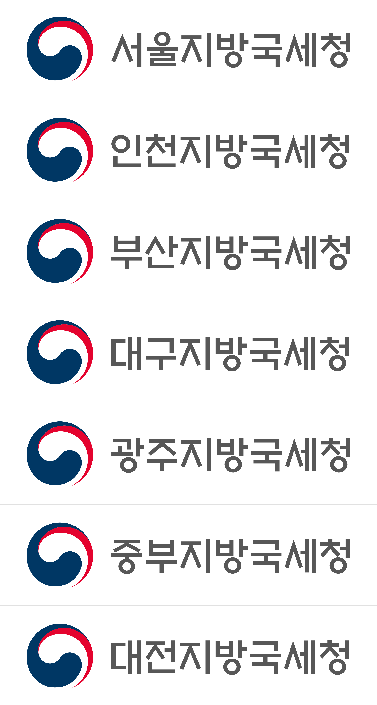
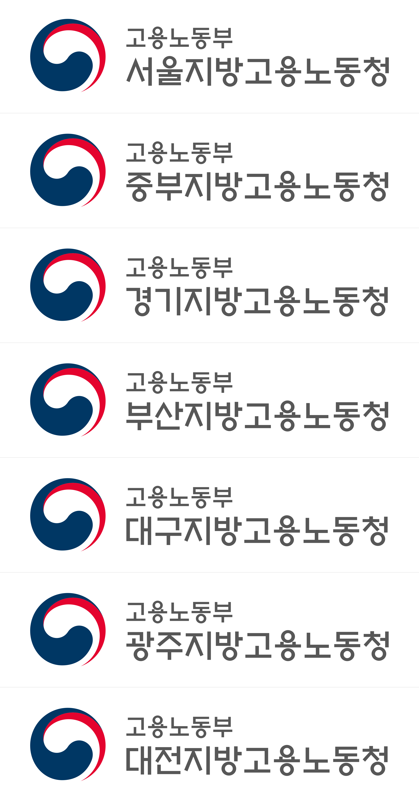
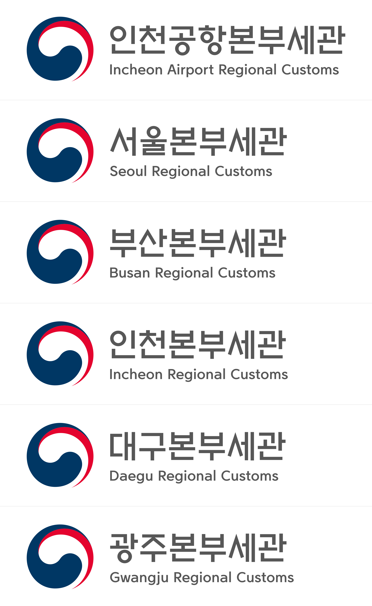
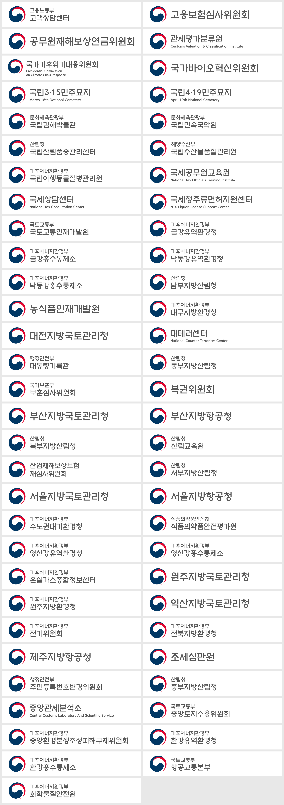

# 정부상징 기관상징 (가로조합)

좌측 정부상징 문양 + 우측 기관명(대한민국 정부상징체)으로 구성한 기관상징입니다.

| 세트 | 형식 | 폴더 |
| --- | --- | --- |
| 지방국세청 7곳 | 국문 가로조합 1행 | `logos/` |
| 지방고용노동청 7곳 (고용노동부 병기) | 본부 병기형 국문 가로조합 A type (2행) | `logos/고용노동부/` |
| 본부세관 6곳 (영문 병기) | 국영문 혼용 가로조합 Type B (국문 + 영문 1행) | `logos/관세청/` |
| 개별 기관 28곳 | 국문 1행 · 10자 이상 2행 · 본부 병기형 A type · 국영문 혼용 Type B · Type A(영문 2행) | `logos/기관별/` |









## 결과물

각 세트 폴더 아래에 같은 구성으로 들어 있습니다.

| 폴더 | 용도 | 색상 |
| --- | --- | --- |
| `svg/` | 화면·웹 (벡터) | RGB — 정부청색 `#003764`, 정부적색 `#E4032E`, 정부회색 `#575757` |
| `pdf/` | 인쇄·Illustrator 편집 (벡터) | 별색 `GOK_Blue`(C100 M70 Y20 K40) · `GOK_Red`(M100 Y80) — 원본 AI와 동일, 기관명 K80 |
| `png/` | 문서·간편 사용 (가로 약 2700px, 백색배경) | RGB |

* 파일명
  * 지방국세청: 원본 데이터 명명 방식 — `서울지방국세청_국문_좌우_1행.svg` 등
  * 지방고용노동청: 요청 파일명 — `광주지방고용노동청 로고.svg` 등
  * 본부세관: 요청 파일명 — `서울본부세관.svg` 등
  * 개별 기관: 요청 파일명 — `조세심판원 로고.svg` 등
* 기관명은 아웃라인(패스)으로 변환되어 있어 서체 설치 없이 사용할 수 있습니다.
* 정부상징 문양의 흰 부분(안쪽과 0.6r 원형 테두리)은 불투명한 흰색 면입니다. SVG·PDF는 문양 밖이 투명합니다.
* 모든 파일의 캔버스에는 **보호공간(좌우 8r, 상하 5r)이 포함**되어 있습니다. 캔버스 안에 다른 요소를 넣지 마세요.
* `구성규정_*.png` — 아래 규정치를 실제 결과물 위에 표시한 검증용 이미지입니다.

## 적용한 규정 (정부상징 디자인 가이드 2017 개정판)

| 항목 | 규정 | 근거 |
| --- | --- | --- |
| 정부상징 문양 | `대한민국정부_국문_좌우_1행.ai`의 벡터 값을 그대로 사용 (백색배경 0.6r 포함) | BS 1-01, 1-04 |
| 문양 크기 | 2R (R = 10r) | BS 3-3-01, 3-3-05 |
| 문양–기관명 간격 | 5.5r, 기관명 좌측정렬 | BS 3-3-01, 3-3-05 |
| 1행 기관명 | 10r (상하 5r), 문양 중심축 = 기관명 중심축. 가로 1행은 글자 수와 관계없이 기본 크기 (10자 이상 포함) | BS 3-3-01, 3-1-03/04 |
| 2행 (A type) | 문양 상단부터 2.3r / 본부명 5.5r / 2.4r / 소속기관명 7.5r / 2.3r | BS 3-3-05 |
| 10자 이상 2행 | 각 줄 70%, 문양 상단부터 1.7r / 7r / 2.6r / 7r / 1.7r | BS 3-1-04 |
| 국영문 혼용 (Type B) | 문양과 5r 간격, 문양 상단부터 2.75r / 국문 8.5r / 3r / 영문 대문자 3r / 2.75r | BS 3-03, 3-3-03 |
| 국영문 혼용 (Type A, 영문 2행) | 5r 간격, 2.75r / 국문 8.5r / 3r / 영문 3r / 2.25r / 영문 3r (영문 둘째 줄은 문양 아래로 내려감) | BS 3-03, 3-3-03 |
| 서체 | 대한민국 정부상징체 국문·영문 (`정부상징체.ttf`). 국문 자간은 서체 기본값, 영문은 kern 표 + 트래킹 −8/1000em(원본 AI 값) | BS 2-01, 2-02 |
| 색상 | 정부청색 · 정부적색 · 정부회색(기관명, K80) | BS 1-03 |
| 보호공간 | 좌우 8r, 상하 5r | BS 1-01 |

* 1행 기관명의 글자 크기(34.656pt, 1 font unit = 0.033844pt), 기준선, 시작 위치는 원본 AI의
  '대한민국정부' 아웃라인을 `정부상징체.ttf` 글리프와 대조해 산출했습니다. 같은 방식으로
  '대한민국정부'를 재생성하면 원본 AI와 글리프 위치 오차가 0.021pt 이하로 일치합니다.
* 글자 높이 규정(10r, 7.5r, 5.5r)은 글리프 높이 기준 795 ~ −97 font unit 구간에 해당합니다.
  2행은 이 구간을 각 줄의 높이에 맞췄습니다(본부명 0.55배, 소속기관명 0.75배).
  가이드 BS 3-3-05 A type 도면의 실제 글자 크기(17.899pt / 24.382pt, 1행 기본 32.534pt 대비 0.550 / 0.749배)와
  치수선 위치(오차 0.07pt 이내)로 확인했습니다.
* 국영문 혼용은 `대한민국정부_국영혼합_좌우_1행.ai`의 국문·영문 아웃라인을 TTF와 대조해 r 단위로 옮겼습니다
  (국문 8.5r 기준선 10.307r, 영문 대문자 높이 2.997r 기준선 17.350r, 잉크 좌단 4.999r — 가이드 치수선과 0.015r 이내).
  원본 AI의 영문은 이전 판 서체로 조판되어 소문자 어센더(h·l·b·f)가 TTF보다 낮으므로, 기준선은 대문자로 산출했습니다.
  영문 자간은 원본 AI 두 파일 모두 균일한 트래킹 −8/1000em이어서 같은 값을 적용했습니다(영문 글자 위치 오차 0.03r 이내).
* 가이드 BS 3-03 Type A(영문 2행)의 영문 행간 라벨 '2.75r'은 도면 치수선과 원본 AI에서 모두 2.25r입니다.

## 사용 시 유의사항 (가이드 요약)

* 최소크기: 문양 지름 8mm(인쇄) / 20px(화면) 미만 사용 금지 — BS 1-01
* 백색배경 사용이 원칙이며, 명도대비 40% 이상의 배경 위에서는 테두리형을 쓰고 기관명을 백색으로 바꿔야 합니다
  (이 저장소의 파일은 백색배경용 기본형입니다) — BS 1-05, 1-11
* 회전·변형·색상 변경·그라데이션·그림자·테두리 적용 금지 — BS 1-09 ~ 1-11

## 다시 만들기

```bash
pip install fonttools cairosvg pillow
# 지방국세청 (1행)
python3 tools/build_gov_symbol.py --font path/to/정부상징체.ttf --out logos
# 지방고용노동청 (본부 병기형 A type 2행)
python3 tools/build_gov_symbol.py --font path/to/정부상징체.ttf --out logos/고용노동부 \
    --type A --parent 고용노동부 --filename "{name} 로고" \
    서울지방고용노동청 중부지방고용노동청 경기지방고용노동청 부산지방고용노동청 \
    대구지방고용노동청 광주지방고용노동청 대전지방고용노동청
# 본부세관 (국영문 혼용 Type B — 영문 2행은 --type 국영A, 영문을 '|' 로 구분)
python3 tools/build_gov_symbol.py --font path/to/정부상징체.ttf --out logos/관세청 \
    --type 국영B --filename "{name}" \
    "인천공항본부세관=Incheon Airport Regional Customs" "서울본부세관=Seoul Regional Customs" \
    "부산본부세관=Busan Regional Customs" "인천본부세관=Incheon Regional Customs" \
    "대구본부세관=Daegu Regional Customs" "광주본부세관=Gwangju Regional Customs"
```

`--type B`는 본부명·소속기관명을 모두 7r로 쓰는 B type입니다.
`--type 2행`은 10자 이상 기관명을 두 줄로 나눕니다 (예: `"산업재해보상보험|재심사위원회"`, 파일명 `--filename "{name} 로고"`).
`정부상징체.ttf`, 원본 `.ai`, 가이드 PDF는 공개 저장소에 재배포하지 않기 위해 포함하지 않았습니다.
