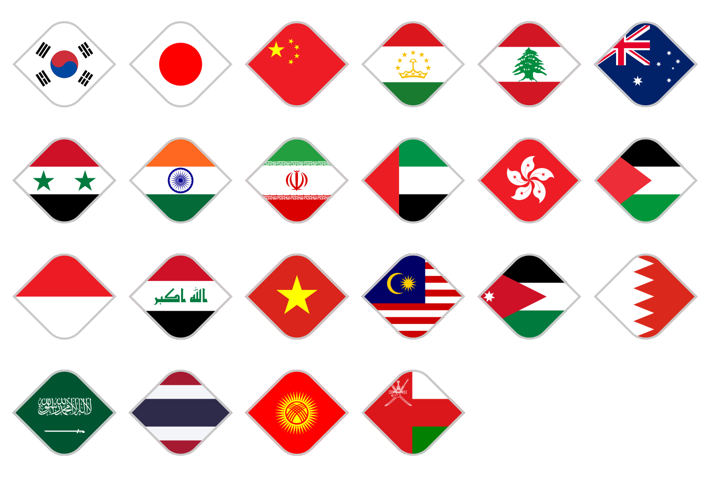

# 2023 AFC 아시안컵 국가 아이콘 (SVG)

카타르·우즈베키스탄 아이콘 SVG를 기준으로, 국기만 각국 국기 SVG로 바꿔 넣은 22개국 아이콘입니다.



순서: 대한민국, 일본, 중국, 타지키스탄, 레바논, 호주 / 시리아, 인도, 이란, 아랍에미리트, 홍콩, 팔레스타인 /
인도네시아, 이라크, 베트남, 말레이시아, 요르단, 바레인 / 사우디아라비아, 태국, 키르기스스탄, 오만

* 파일: `svg/2023 AFC 아시안컵 (국호) 아이콘.svg`
* 캔버스: 기준 파일과 같은 `49.112 × 49.112` (`viewBox="0 0 49.112 49.112"`), 마름모 밖은 투명

## 만든 방법

자료는 Google Drive `아시안컵 아이콘` 폴더의 파일입니다.

| 항목 | 기준 |
| --- | --- |
| 아이콘 틀 | `2023 AFC 아시안컵 카타르/우즈베키스탄 아이콘.svg` — 마름모 클립(`a`), 클립 그룹 좌표(`translate(-190.225 -1001.586)`), 테두리(`#c9c9c9`)를 그대로 사용 |
| 국기 크기·위치 | `2023 AFC 아시안컵 (국호) 아이콘.png` (240×240)에서 측정 |
| 국기 마크업(색·선·도형) | `(국호) 국기.svg` |

* **크기 환산** — PNG에서 줄무늬 국기의 높이는 180px이고, 우즈베키스탄 기준 SVG의 국기 높이는 39.304입니다.
  이 비율(1 SVG 단위 = 4.58px)로 PNG의 마름모 중심을 SVG 마름모 중심에 맞춰 옮겼습니다.
* **측정** — 줄무늬 경계, 엠블럼(원·별·태극 등)의 외곽 크기, PNG와 국기 렌더링의 픽셀 차이가 가장 작아지는 위치를 함께 보고
  국기마다 높이와 중심을 정했습니다(`tools/build_afc_icons.py`의 `CONFIG`).
* **국기 마크업** — 색상값과 도형 좌표는 국기 파일 그대로입니다. 국기 하나를 `matrix(s 0 0 s x y)` 그룹에 넣고
  국기 사각형으로 클립했습니다(우즈베키스탄 기준 파일이 국기 문양 그룹을 `translate` + 클립 `b`로 넣은 것과 같은 방식). 다음만 정리했습니다.
  * CSS 클래스(`<style>`)와 `style` 속성은 같은 값의 표현 속성(`fill` 등)으로 풀었습니다.
  * `id`는 기준 파일의 `a`·`b`와 겹치지 않게 `c`, `d`, …로 바꾸고, 쓰이지 않는 `id`와 보이지 않는 편집기 흔적(빈 `rect`, `class`)은 지웠습니다.
* **바탕** — 국기가 마름모를 다 덮지 못하는 나라(대한민국, 일본, 중국, 레바논, 베트남, 바레인, 사우디아라비아, 키르기스스탄)는
  국기 가장자리와 같은 색을 마름모 전체에 깔았습니다.

## 나라별 참고

| 국가 | 내용 |
| --- | --- |
| 시리아 | 대회 당시 국기(빨강·하양·검정, 초록 별 2개)인 `시리아 국기(1980-2024).svg`를 썼습니다. 같은 폴더의 `시리아 국기.svg`는 현재 국기(붉은 별 3개)입니다. |
| 이란 | `아시안컵 아이콘` 폴더에 `이란 국기.svg`가 없어 `원형국기/이란.svg`(직사각형 국기)를 썼습니다. 이 파일은 캔버스 가장자리에 1px 여백이 있어 국기 영역(1, 1, 1134×648)만 잘라 썼습니다. |
| 타지키스탄 | 국기 파일에 같은 그림이 두 벌 겹쳐 있고 그 사이에 작업용 안내선이 있습니다. 위 벌이 나머지를 완전히 덮으므로 보이는 위 벌만 넣었습니다. |
| 레바논 | PNG의 흰 띠 폭에 맞춰 국기를 줄이고(삼나무 크기도 일치), 위·아래 빨강은 바탕색으로 이었습니다. |
| 대한민국·일본·베트남·홍콩·중국·키르기스스탄·사우디아라비아 | 태극·괘, 원, 별, 꽃, 태양, 글자·칼의 크기로 국기 크기를 정했습니다. |
| 오만 | PNG는 국장(엠블럼)을 붉은 세로띠 오른쪽으로 옮기고 키워 그렸습니다. 국기 파일 그대로면 국장이 마름모 밖으로 잘려, 국장 마크업만 PNG의 위치·크기로 옮겼습니다. |
| 말레이시아 | PNG는 초승달·별을 줄여 칸톤 가운데에 그렸습니다. 같은 이유로 초승달·별 마크업만 PNG의 위치·크기로 옮겼습니다. |
| 호주 | PNG는 유니언 잭(칸톤)을 약 1.44:1 상자(국기 파일은 2:1)에 그렸고, 연방의 별과 남십자성은 작게(약 0.43배) 그려 마름모 안에 모았습니다. 유니언 잭은 국기 파일의 구성(대각선 흰 선과 엇갈린 붉은 선, 흰 테 두른 붉은 십자)과 색·선 굵기 비율을 그대로 두고 상자 크기·위치만 PNG에 맞춰 다시 배치했고, 별 6개는 위치·크기를 PNG에 맞췄습니다(별 모양은 국기 파일의 `use` 그대로). |

오만·말레이시아·호주를 국기 파일 비율 그대로(요소를 옮기지 않고) 넣으면 국장·초승달·별 일부가 마름모 밖으로 잘리고, PNG와 배치도 크게 달라집니다.

## 다시 만들기

```bash
pip install cairosvg pillow   # 미리보기를 만들 때만 필요
# 국기폴더: Drive '아시안컵 아이콘' 폴더의 '(국호) 국기.svg', '시리아 국기(1980-2024).svg'
#           + 원형국기/이란.svg 를 '이란 국기.svg' 로
python3 tools/build_afc_icons.py --flags 국기폴더 --out 아시안컵/svg --preview 아시안컵/미리보기.png
```

국기 SVG와 PNG 아이콘은 이 저장소에 포함하지 않았습니다.
